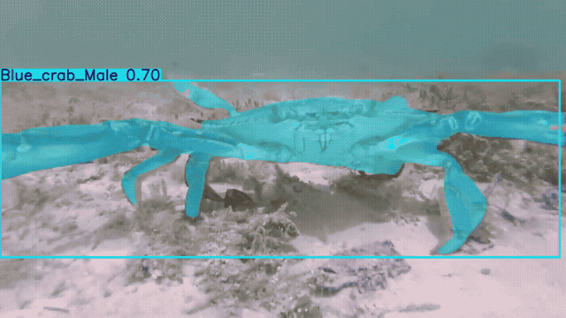
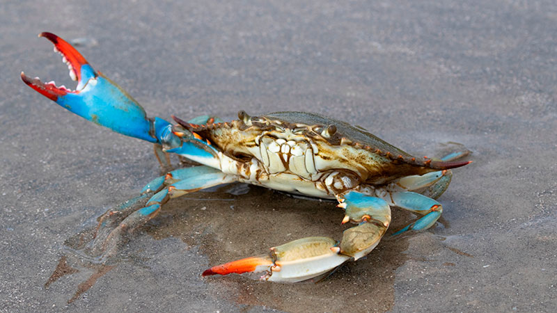
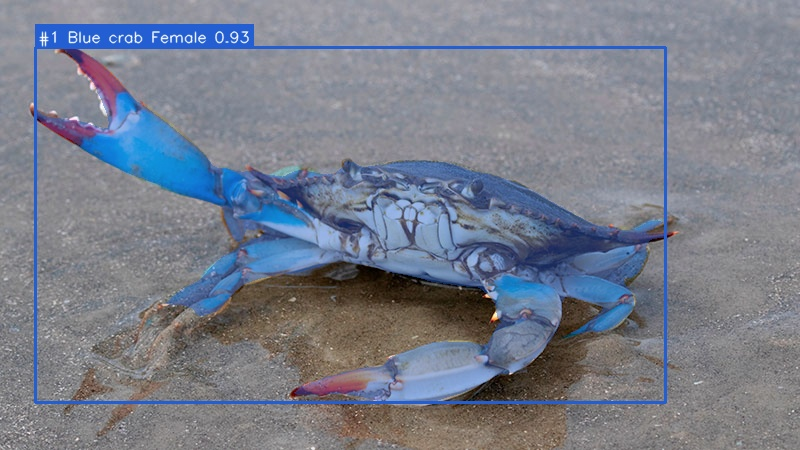
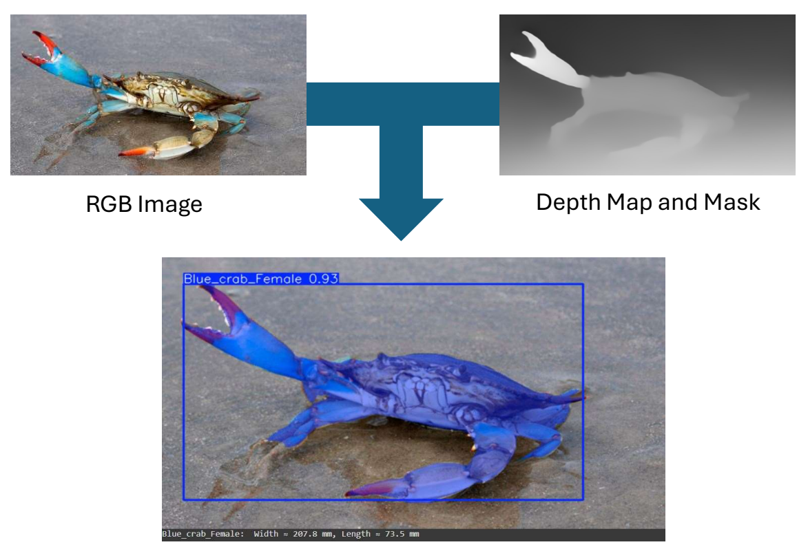
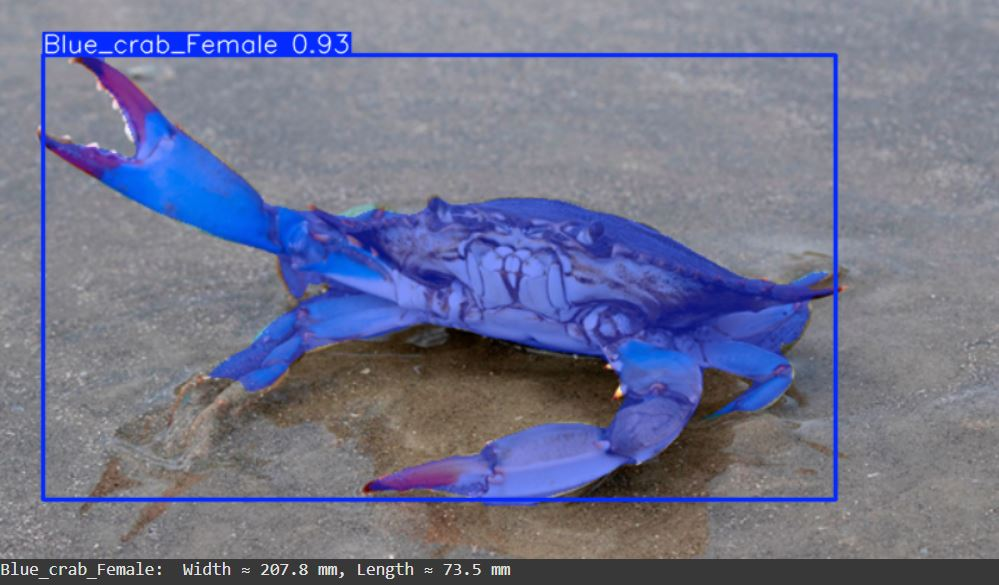
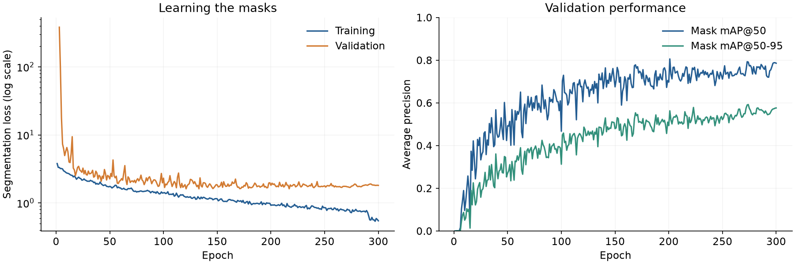

# Blue crab segmentation and dimension estimation

I built this project to connect blue crab recognition with size estimation: locate the animal, identify its class, trace its boundary, and use depth and camera calibration to express its visible extent in millimeters.

The original experiment was completed in July 2025. This repository makes the model easier to run and inspect, with recovered training settings and a fresh evaluation of the archived test split.

**Author:** [Arman Neyestani](https://github.com/A8neyestani) · **Stack:** Python, Ultralytics, PyTorch, OpenCV, NumPy

## Motivation

The motivation was to support marine monitoring and aquaculture research with a repeatable way to record both the type of crab and its size. Manual image annotation and caliper measurements require time and direct intervention. My aim was to explore how much of that workflow could be handled from imagery, with eventual use in an underwater observation or robotic system.

Recognizing a crab is only part of that task: a mask gives its outline in pixels, but its apparent size changes with distance from the camera. The central contribution of this project is the integration of four-class instance segmentation with depth-based geometry and PCA-based dimension estimation. Segmentation selects the relevant pixels; aligned metric depth and camera intrinsics supply scale; PCA finds the main directions of the visible shape. This connects an image-recognition result to a potential biological measurement workflow.

## Demo

[](assets/demo.mp4)

**[Watch the full 24-second demo](assets/demo.mp4)** · [Download the MP4](assets/demo.mp4?raw=true)

The animation is an excerpt from the original video demonstration. The MP4 contains the full sequence, including difficult frames where the crab is obscured. It is a qualitative example, not a runtime benchmark. The preview plays directly in this README; click it to open the video.

| Example input | Current pipeline output |
| --- | --- |
|  |  |

This still is an existing project example, not an independently collected test. The mask includes the visible body and appendages; the confidence score describes a detection, not measurement accuracy.

## What I worked on

The project covers a four-class polygon-annotated dataset, fine-tuning a pretrained segmentation model, checking detection and mask quality, and converting mask pixels into metric coordinates when depth and camera calibration are available. I used YOLO11m-seg as the starting point so the work could focus on the crab dataset and the downstream geometry.

The code keeps each detected animal as a separate instance. It saves masks, an overlay and a JSON record without requiring a desktop display. Optional dimension estimates are attached to each instance rather than merging every crab of the same class.

## Experimental dimension estimation

This is the part of the project that connects recognition to measurement. The original design combines an RGB frame, its aligned depth map and a calibrated camera model, then estimates dimensions from the segmented region.



*Figure 3, extracted from page 8 of the original July 2025 project report. It illustrates the RGB, depth and output stages. In the implementation, YOLO takes the RGB image; depth is used afterward for geometry, not as a second input to YOLO.*

### From a mask to millimeters

1. **Segment the RGB image.** YOLO11m-seg returns a class, confidence score and mask for each detected instance. The mask must remain aligned with the original RGB pixel coordinates.
2. **Select valid depth samples.** For every mask pixel `(u, v)`, read the aligned depth `Z` in meters. Exclude missing, non-positive and non-finite depths.
3. **Back-project into camera coordinates.** Use the calibrated focal lengths `(fx, fy)` and principal point `(cx, cy)` to obtain the metric coordinates below. Each pixel defines a point `(X, Y, Z)`; the current estimator uses its `(X, Y)` projection.

```text
X = (u - cx) * Z / fx
Y = (v - cy) * Z / fy
```

4. **Find the main axes.** Center the `(X, Y)` points by subtracting their mean, then use singular value decomposition to find the two PCA directions. This follows the orientation of the projected shape instead of using the horizontal and vertical image axes.
5. **Measure the extents.** Project the centered points onto those directions. For each axis, subtract the minimum coordinate from the maximum and multiply by 1,000 to convert meters to millimeters.

```text
centered_points = points_xy - mean(points_xy)
axis_coordinates = centered_points @ pca_axes.T
extent_mm = (max(axis_coordinates) - min(axis_coordinates)) * 1000
```

The last line is evaluated separately for each PCA axis. The current outputs are named `pca_axis_1_mm` and `pca_axis_2_mm`: they are projected whole-mask extents, not anatomical length/width or full 3D surface measurements. Limb position, camera angle, occlusion and depth outliers all affect them. The original prototype merged masks by class; this repository applies the geometry to each instance so two crabs of the same class are measured separately.

### Original measurement demonstration



*The original prototype displays approximately 207.8 mm and 73.5 mm. This screenshot is retained as a record of the measurement demonstration, not as a verified physical measurement or output reproduced by the revised pipeline. Its legacy Width/Length labels are replaced by explicit PCA-axis names in the current code. The archived 8-bit depth preview and undocumented calibration are insufficient to validate those values.*

### Run with calibrated depth

Supply an RGB-aligned metric depth map and the camera matrix for that exact RGB resolution. `intrinsics.json` must contain a numeric 3×3 array with rows `[fx, 0, cx]`, `[0, fy, cy]`, `[0, 0, 1]`. Calibration values must come from your camera; no sample calibration is assumed.

```bash
python crab.py predict --image your_rgb.jpg --depth your_depth.png --depth-scale 0.001 --intrinsics intrinsics.json --output outputs/measurement
```

`--depth-scale` is meters per stored unit: use `0.001` for millimeter-valued depth or `1` for a `.npy` depth array already in meters. The loader accepts single-channel depth images or numeric `.npy` arrays and rejects 8-bit depth previews. Zero, negative and non-finite depths are excluded; fewer than ten valid mask pixels yields `null` dimensions rather than a misleading zero measurement.

**Measurement accuracy is unvalidated.** There is no calibrated reference-measurement study in this repository. Underwater use would additionally need a suitable imaging setup and calibration for the optical conditions. The runnable example and video demonstrate segmentation; the historical measurement screenshot above documents the original prototype.

## Results

The two columns below refer to different splits and evaluation runs. Values are percentages.

| Metric | Original validation, 53 images | Test re-evaluation, 26 images |
| --- | ---: | ---: |
| Box mAP@50 | 80.71 | 90.8 |
| Box mAP@50–95 | 69.59 | 78.2 |
| Mask mAP@50 | 79.13 | 85.7 |
| Mask mAP@50–95 | 59.23 | 67.6 |
| Mask precision | 80.30 | 84.5 |
| Mask recall | 72.50 | 85.5 |

The validation values come from metadata stored in `best.pt`. The test values were measured again on 11 September 2026 using that same checkpoint, Ultralytics 8.3.167, Python 3.12.14, PyTorch 2.14.0 on CPU, 640-pixel inputs and batch size 1. Evaluation uses Ultralytics' validation thresholds; the demo uses a confidence threshold of 0.30.

| Test class | Annotated instances | Mask mAP@50 | Mask mAP@50–95 |
| --- | ---: | ---: | ---: |
| Female blue crab | 12 | 90.1 | 72.5 |
| Male blue crab | 8 | 98.2 | 57.6 |
| Eggs | 4 | 99.5 | 96.2 |
| Other crabs | 7 | 55.1 | 44.1 |

There are only 31 annotated instances in this test split, including four egg instances. These scores are useful for inspecting the archived experiment, but do not establish performance on a new deployment site. In particular, the high egg score rests on very few examples. Other crabs remain the weakest test class, and the gap between male-crab mAP@50 and mAP@50–95 shows that finding an animal and tracing its boundary accurately are different challenges.



The curves above are reconstructed from the training history embedded in the checkpoint. No new 300-epoch training run was performed for this release.

## Run it locally

Use **Python 3.12**. The dependency versions below were exercised on Windows with CPU inference.

```bash
git clone https://github.com/A8neyestani/Blue_crabs.git
cd Blue_crabs
python -m venv .venv
```

Activate the environment with `.venv\Scripts\Activate.ps1` in Windows PowerShell, or `source .venv/bin/activate` on macOS/Linux. Then:

```bash
python -m pip install -r requirements.txt
```

Download **[best.pt from the v1.0.0 release](https://github.com/A8neyestani/Blue_crabs/releases/download/v1.0.0/best.pt)** and place it at `weights/best.pt`. The checkpoint is approximately 45 MB and is kept outside the Git history.

SHA-256:

```text
2a6c38cfd73837393e3eefbd0455a3f25f14625fc2cbe2f8cf64a90c8e7cbb73
```

```bash
python crab.py predict --image assets/example.jpg --weights weights/best.pt --output outputs/example
```

The output directory contains `overlay.jpg`, one binary PNG mask per instance, and `predictions.json` with class IDs, names, confidence scores and mask filenames. An image with no detections produces an unchanged overlay and an empty JSON list. Use a new output directory for each image.

Use `--confidence 0.50` to change the detection threshold, `--iou` to change suppression, or `--device 0` when using a compatible CUDA-enabled PyTorch installation. GPU execution was not tested for this release.

## Dataset and training

The archived Roboflow export contains **631 images** with four classes:

| Split | Images | Polygon instances |
| --- | ---: | ---: |
| Training | 552 | 687 |
| Validation | 53 | 68 |
| Test | 26 | 31 |

Class IDs are `0: Blue_crab_Female`, `1: Blue_crab_Male`, `2: Eggs`, and `3: Other_crabs`. These are object/region labels: an egg cluster can be annotated separately from the animal carrying it.

The dataset export identifies [Roboflow blue-crab, version 1](https://universe.roboflow.com/neyestanisetelco/blue-crab/dataset/1) as its source. Access and export may require a Roboflow account. Images include web-sourced material with varied viewpoints, backgrounds and image quality; they should not be described as a uniform collection of calibrated underwater captures. The image count includes augmented training examples, not 631 independent observations.

The archived split was checked for byte-identical images across splits and shared Roboflow source-name stems; neither check found overlap. Visually similar images and alternative encodings were not exhaustively audited, so this is not a guarantee against data leakage. Polygon coordinates were checked for valid normalized ranges and image/label counts agree in every split.

Download a YOLO segmentation export and extract it under `data/`. In its `data.yaml`, set `path` to the absolute extracted directory and use:

```yaml
train: train/images
val: valid/images
test: test/images
nc: 4
names: [Blue_crab_Female, Blue_crab_Male, Eggs, Other_crabs]
```

Retain the archived split when comparing with these results. An updated export or different preprocessing can change the scores.

```bash
python crab.py evaluate --data data/data.yaml --weights weights/best.pt --split test
python crab.py train --data data/data.yaml --device 0
```

Evaluation saves plots and sample predictions under `runs/evaluate/`. Training uses [train.yaml](train.yaml), recovered from the checkpoint: COCO-pretrained `yolo11m-seg.pt`, 300 epochs, batch 16, image size 640, AdamW, initial learning rate 0.005, five warm-up epochs and a linear learning-rate schedule. Mosaic, horizontal flips and HSV augmentation were enabled; training-time MixUp was zero. Roboflow preprocessing/augmentation and Ultralytics training augmentation are separate stages.

The training command downloads the upstream pretrained model if necessary. The settings document the original run, but identical scores are not promised across hardware, library versions or dataset exports.

## Checks and next experiments

```bash
python -m unittest -v
```

The regression tests cover known metric geometry, depth units, invalid depth and calibration, missing images, empty detections, and separate animals of the same class. The release was also checked with real checkpoint inference and evaluation on the full archived test split.

The next useful experiments would be a larger source-separated test collection, a closer review of other-crab errors, and comparison of depth-based extents against physical reference measurements. Speed claims would require a separate benchmark on the intended hardware.

## Attribution and reuse

The model is based on [Ultralytics YOLO11 segmentation](https://docs.ultralytics.com/tasks/segment/), starting from COCO-pretrained weights. The checkpoint carries Ultralytics' AGPL-3.0 metadata. The Roboflow export declares MIT, while individual source images may have separate attribution and reuse terms. No blanket license for third-party images or video is asserted here. The raw collection and internal project report are not included in the repository.
